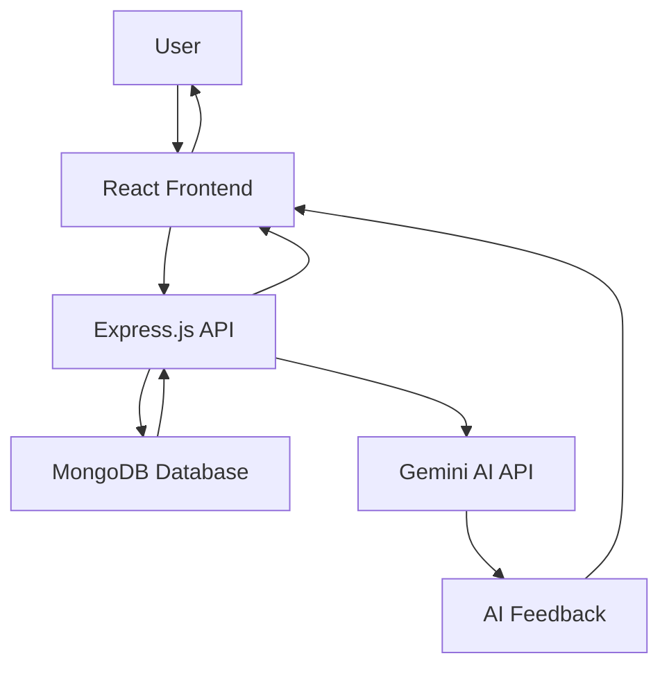

# 🧠 AI Quiz Platform

<div align="center">


**A Modern, Professional Quiz Application with AI-Powered Feedback**

_Create • Share • Learn • Excel_

[🚀 Quick Start](#-quick-start) • [✨ Features](#-features) • [🏗️ Architecture](#️-architecture) • [🎨 Screenshots](#-screenshots) • [📖 API Reference](#-api-reference)

</div>

---

## 📋 Table of Contents

- [🌟 Overview](#-overview)
- [✨ Features](#-features)
- [🚀 Quick Start](#-quick-start)
- [🛠️ Installation](#️-installation)
- [🏗️ Architecture](#️-architecture)
- [🎨 Screenshots](#-screenshots)
- [📖 API Reference](#-api-reference)
- [🧪 Testing](#-testing)
- [🚀 Deployment](#-deployment)
- [🤝 Contributing](#-contributing)
- [📄 License](#-license)

---

## 🌟 Overview

The **AI Quiz Platform** is a cutting-edge, full-stack web application that revolutionizes the quiz-taking and quiz-creation experience. Built with modern technologies and featuring AI-powered feedback, it provides a comprehensive solution for educators, students, and knowledge enthusiasts.

### 🎯 Why Choose AI Quiz Platform?

- **🔥 Modern Stack**: React.js frontend with Node.js/Express backend
- **🤖 AI-Powered**: Gemini AI integration for personalized feedback
- **⏱️ Smart Timing**: Advanced timer system with visual warnings
- **🎨 Professional UI**: World-class design with glassmorphism effects
- **📱 Fully Responsive**: Perfect experience on all devices
- **🔒 Robust**: Comprehensive error handling and validation

---

## ✨ Features

### 🎮 **For Quiz Takers**

| Feature                            | Description                                                              |
| ---------------------------------- | ------------------------------------------------------------------------ |
| **⏰ Smart Timer System**          | Visual countdown with color-coded warnings (30-second alerts)            |
| **🎯 Interactive Quiz Experience** | Smooth transitions, progress tracking, and intuitive navigation          |
| **🤖 AI-Powered Feedback**         | Personalized feedback based on performance using Gemini AI               |
| **📊 Beautiful Results**           | Circular progress indicators, performance badges, and detailed analytics |
| **📱 Responsive Design**           | Optimized for desktop, tablet, and mobile devices                        |
| **🔄 Auto-Submit**                 | Automatic quiz submission when time expires                              |

### 🛠️ **For Quiz Creators**

| Feature                         | Description                                                       |
| ------------------------------- | ----------------------------------------------------------------- |
| **✨ Intuitive Quiz Builder**   | Drag-and-drop interface with real-time validation                 |
| **📝 Rich Question Management** | Support for multiple-choice questions with 4 customizable options |
| **🎚️ Flexible Settings**        | Custom time limits, difficulty levels, and categories             |
| **📂 Category System**          | 8+ predefined categories (Science, Technology, History, etc.)     |
| **⚙️ Difficulty Levels**        | Easy, Medium, Hard with visual indicators                         |
| **🔍 Form Validation**          | Real-time validation with helpful error messages                  |

### 👨‍💼 **For Administrators**

| Feature                 | Description                                            |
| ----------------------- | ------------------------------------------------------ |
| **📊 Live Dashboard**   | Real-time statistics and quiz analytics                |
| **🗑️ Safe Deletion**    | Confirmation modals with undo protection               |
| **🔍 Advanced Search**  | Search by title, description, category, and difficulty |
| **📈 Quiz Management**  | Complete CRUD operations with audit trails             |
| **🏷️ Filtering System** | Multi-level filtering by category and difficulty       |
| **📅 Timestamps**       | Creation and modification tracking                     |

### 🎨 **UI/UX Excellence**

- **✨ Glassmorphism Design**: Modern translucent effects with backdrop blur
- **🌈 Professional Color Palette**: Carefully crafted gradient schemes
- **🎭 Smooth Animations**: CSS transitions and keyframe animations
- **📐 Responsive Grid**: CSS Grid and Flexbox for perfect layouts
- **🔤 Typography Scale**: Harmonious font sizing and spacing
- **🎪 Micro-interactions**: Hover effects, loading states, and visual feedback

---

## 🚀 Quick Start

### Prerequisites

Before you begin, ensure you have the following installed:

- **Node.js** (v14.0.0 or higher)
- **npm** (v6.0.0 or higher)
- **MongoDB** (v4.0.0 or higher)
- **Git** (latest version)

### 🏃‍♂️ Run in 3 Steps

```bash
# 1. Clone the repository
git clone https://github.com/YourUsername/ai-quiz-app.git
cd ai-quiz-app

# 2. Start the backend
cd backend
npm install
npm start

# 3. Start the frontend (in a new terminal)
cd ../frontend
npm install
npm start
```

🎉 **That's it!** Your application will be running at:

- **Frontend**: http://localhost:3001
- **Backend**: http://localhost:3000

---

## 🛠️ Installation

### 📦 Backend Setup

```bash
cd backend

# Install dependencies
npm install

# Create environment file
cp .env.example .env

# Configure your environment variables
# Edit .env file with your settings:
# - MONGODB_URI=mongodb://localhost:27017/quiz-app
# - GEMINI_API_KEY=your_gemini_api_key
# - PORT=3000

# Start MongoDB (if using local installation)
mongod

# Run the server
npm start
```

#### Backend Dependencies

```json
{
  "express": "^4.18.2",
  "mongoose": "^7.5.0",
  "@google/generative-ai": "^0.1.3",
  "cors": "^2.8.5",
  "dotenv": "^16.3.1"
}
```

### 🎨 Frontend Setup

```bash
cd frontend

# Install dependencies
npm install

# Start development server
npm start

# Build for production
npm run build
```

#### Frontend Dependencies

```json
{
  "react": "^18.2.0",
  "react-dom": "^18.2.0",
  "axios": "^1.5.0",
  "react-scripts": "5.0.1"
}
```

---

## 🏗️ Architecture

### 📁 Project Structure

```
ai-quiz-app/
├── 📁 backend/                 # Node.js/Express Server
│   ├── 📁 controllers/         # Business logic
│   │   └── quizController.js   # Quiz CRUD & AI operations
│   ├── 📁 models/              # Database schemas
│   │   └── Quiz.js            # MongoDB Quiz model
│   ├── 📁 routes/              # API routes
│   │   └── quizRoutes.js      # RESTful endpoints
│   ├── server.js               # Express server setup
│   ├── package.json            # Backend dependencies
│   └── .env                    # Environment variables
│
├── 📁 frontend/                # React.js Client
│   ├── 📁 public/              # Static assets
│   │   ├── index.html          # HTML template
│   │   └── manifest.json       # PWA manifest
│   ├── 📁 src/                 # Source code
│   │   ├── 📁 components/      # React components
│   │   │   ├── Quiz.js         # Quiz taking interface
│   │   │   ├── QuizList.js     # Quiz browser & search
│   │   │   ├── QuizCreator.js  # Quiz creation form
│   │   │   ├── Results.js      # Results & AI feedback
│   │   │   ├── Quiz.css        # Quiz component styles
│   │   │   ├── QuizList.css    # Quiz list styles
│   │   │   ├── QuizCreator.css # Creator form styles
│   │   │   └── Results.css     # Results page styles
│   │   ├── App.js              # Main application logic
│   │   ├── App.css             # Global styles & variables
│   │   ├── index.js            # React DOM entry point
│   │   └── index.css           # CSS reset & globals
│   └── package.json            # Frontend dependencies
│
├── requests.http               # API testing file
├── README.md                   # This documentation
└── .gitignore                  # Git ignore rules
```

### 🔄 Data Flow Architecture



### 🛡️ Security Features

- **Input Validation**: Comprehensive data validation on both client and server
- **Error Handling**: Graceful error handling with user-friendly messages
- **Data Sanitization**: MongoDB injection prevention
- **CORS Configuration**: Proper cross-origin resource sharing setup
- **Environment Variables**: Sensitive data protection

---

## 🎨 Screenshots

### 🏠 Homepage & Quiz Browser


_Features: Live statistics, category filtering, search functionality, and beautiful quiz cards_

### ✨ Quiz Creation Interface


_Features: Dynamic question management, category selection, difficulty settings, and time limits_

### ⏱️ Timed Quiz Experience


_Features: Visual countdown timer, progress tracking, and smooth question navigation_

### 📊 AI-Powered Results


_Features: Circular progress indicators, performance analysis, and personalized AI feedback_

---

## 📖 API Reference

### 🎯 Quiz Endpoints

#### Get All Quizzes

```http
GET /api/quizzes
```

**Response:**

```json
[
  {
    "_id": "64f7b1234567890123456789",
    "title": "JavaScript Fundamentals",
    "description": "Test your knowledge of JavaScript basics",
    "difficulty": "Medium",
    "category": "Technology",
    "timeLimit": 300,
    "createdAt": "2023-09-06T10:30:00.000Z"
  }
]
```

#### Get Quiz by ID

```http
GET /api/quizzes/:id
```

**Response:**

```json
{
  "_id": "64f7b1234567890123456789",
  "title": "JavaScript Fundamentals",
  "description": "Test your knowledge of JavaScript basics",
  "difficulty": "Medium",
  "category": "Technology",
  "timeLimit": 300,
  "questions": [
    {
      "_id": "64f7b1234567890123456790",
      "questionText": "What is JavaScript?",
      "options": [
        "A programming language",
        "A markup language",
        "A database",
        "An operating system"
      ]
    }
  ]
}
```

#### Create New Quiz

```http
POST /api/quizzes
Content-Type: application/json

{
  "title": "React Basics",
  "description": "Learn React fundamentals",
  "difficulty": "Easy",
  "category": "Technology",
  "timeLimit": 600,
  "questions": [
    {
      "questionText": "What is React?",
      "options": ["Library", "Framework", "Language", "Database"],
      "correctAnswer": "Library"
    }
  ]
}
```

#### Update Quiz

```http
PUT /api/quizzes/:id
Content-Type: application/json

{
  "title": "Updated Title",
  "description": "Updated description",
  "difficulty": "Hard"
}
```

#### Delete Quiz

```http
DELETE /api/quizzes/:id
```

#### Submit Quiz Answers

```http
POST /api/quizzes/:id/submit
Content-Type: application/json

{
  "answers": {
    "64f7b1234567890123456790": "A programming language",
    "64f7b1234567890123456791": "Facebook"
  }
}
```

**Response:**

```json
{
  "score": 8,
  "total": 10,
  "percentage": 80,
  "passed": true
}
```

#### Get AI Feedback

```http
POST /api/feedback
Content-Type: application/json

{
  "quizTopic": "JavaScript Fundamentals",
  "score": 8,
  "total": 10
}
```

**Response:**

```json
{
  "feedback": "Great job! You scored 80% on JavaScript Fundamentals. Focus on improving your understanding of async/await and closures for even better results.",
  "isAIGenerated": true
}
```

### 📊 Response Codes

| Code | Status                | Description                   |
| ---- | --------------------- | ----------------------------- |
| 200  | OK                    | Request successful            |
| 201  | Created               | Resource created successfully |
| 400  | Bad Request           | Invalid request data          |
| 404  | Not Found             | Resource not found            |
| 500  | Internal Server Error | Server error occurred         |

---

## 🧪 Testing

### 🔧 Manual Testing

1. **Quiz Creation**: Create quizzes with various configurations
2. **Timer Functionality**: Test countdown and auto-submit features
3. **Search & Filter**: Verify search and filtering capabilities
4. **Delete Operations**: Test deletion with confirmation modals
5. **Responsive Design**: Check across different screen sizes

### 📝 Test Cases

```bash
# Test API endpoints using requests.http file
# Located at: /requests.http

# Example test cases:
GET http://localhost:3000/api/quizzes
POST http://localhost:3000/api/quizzes
DELETE http://localhost:3000/api/quizzes/[quiz-id]
```

### 🐛 Known Issues

- ⚠️ **Timer Warning**: React Hook dependency warning (cosmetic only)
- 🔄 **Refresh**: Manual refresh needed after some operations
- 📱 **Mobile**: Minor layout adjustments on very small screens

---

## 🚀 Deployment

### 🌐 Production Build

```bash
# Build frontend for production
cd frontend
npm run build

# The build folder contains optimized production files
# Serve using any static file server
```

### ☁️ Cloud Deployment Options

#### **Vercel (Recommended for Frontend)**

```bash
# Install Vercel CLI
npm i -g vercel

# Deploy frontend
cd frontend
npm run build
vercel --prod
```

#### **Heroku (Backend)**

```bash
# Install Heroku CLI
# Create Procfile in backend directory:
echo "web: node server.js" > Procfile

# Deploy to Heroku
heroku create your-quiz-app
git push heroku main
```

#### **MongoDB Atlas (Database)**

1. Create account at [MongoDB Atlas](https://cloud.mongodb.com)
2. Create cluster and get connection string
3. Update `MONGODB_URI` in environment variables

### 🔧 Environment Variables

Create `.env` files for both environments:

**Backend (.env):**

```env
MONGODB_URI=mongodb://localhost:27017/quiz-app
GEMINI_API_KEY=your_gemini_api_key
PORT=3000
NODE_ENV=production
```

**Frontend (.env.production):**

```env
REACT_APP_API_URL=https://your-api-domain.com
```

---

## 🤝 Contributing

We welcome contributions! Here's how to get started:

### 🔄 Development Workflow

1. **Fork** the repository
2. **Create** a feature branch (`git checkout -b feature/amazing-feature`)
3. **Commit** your changes (`git commit -m 'Add some amazing feature'`)
4. **Push** to the branch (`git push origin feature/amazing-feature`)
5. **Open** a Pull Request

### 📝 Contribution Guidelines

- **Code Style**: Follow existing patterns and conventions
- **Testing**: Add tests for new features
- **Documentation**: Update README for significant changes
- **Commits**: Use clear, descriptive commit messages
- **Issues**: Check existing issues before creating new ones

### 🐛 Bug Reports

When reporting bugs, please include:

- **Steps to reproduce**
- **Expected behavior**
- **Actual behavior**
- **Screenshots** (if applicable)
- **Environment details**

### 💡 Feature Requests

For feature requests, please describe:

- **The problem** you're trying to solve
- **Proposed solution**
- **Alternative solutions** considered
- **Additional context**

---

## 📄 License

This project is licensed under the **MIT License** - see the [LICENSE](LICENSE) file for details.

```
MIT License

Copyright (c) 2025 AI Quiz Platform

Permission is hereby granted, free of charge, to any person obtaining a copy
of this software and associated documentation files (the "Software"), to deal
in the Software without restriction, including without limitation the rights
to use, copy, modify, merge, publish, distribute, sublicense, and/or sell
copies of the Software, and to permit persons to whom the Software is
furnished to do so, subject to the following conditions:

The above copyright notice and this permission notice shall be included in all
copies or substantial portions of the Software.

THE SOFTWARE IS PROVIDED "AS IS", WITHOUT WARRANTY OF ANY KIND, EXPRESS OR
IMPLIED, INCLUDING BUT NOT LIMITED TO THE WARRANTIES OF MERCHANTABILITY,
FITNESS FOR A PARTICULAR PURPOSE AND NONINFRINGEMENT.
```

---

## 👥 Team & Acknowledgments

### 🙏 Special Thanks

- **Google Gemini AI** for providing intelligent feedback capabilities
- **MongoDB** for reliable database solutions
- **React Community** for excellent documentation and resources
- **All Contributors** who helped make this project amazing

### 📞 Support & Contact

- **📧 Email**: [your-email@domain.com](mailto:your-email@domain.com)
- **🐛 Issues**: [GitHub Issues](https://github.com/YourUsername/ai-quiz-app/issues)
- **💬 Discussions**: [GitHub Discussions](https://github.com/YourUsername/ai-quiz-app/discussions)
- **🐦 Twitter**: [@YourTwitterHandle](https://twitter.com/YourTwitterHandle)

---

<div align="center">

### ⭐ Star this repository if you found it helpful!

[](https://github.com/YourUsername/ai-quiz-app)
[](https://github.com/YourUsername/ai-quiz-app)

**Made with ❤️ and ☕ by the AI Quiz Platform Team**

_Ready to revolutionize learning? Let's build amazing quizzes together!_ 🚀

</div>

---

## 📚 Additional Resources

### 🔗 Useful Links

- [React Documentation](https://reactjs.org/docs/)
- [Express.js Guide](https://expressjs.com/en/guide/)
- [MongoDB Manual](https://docs.mongodb.com/manual/)
- [Google Gemini AI](https://ai.google.dev/)
- [CSS Grid Guide](https://css-tricks.com/snippets/css/complete-guide-grid/)
- [Flexbox Guide](https://css-tricks.com/snippets/css/a-guide-to-flexbox/)

### 📖 Learning Resources

- [JavaScript ES6+ Features](https://github.com/lukehoban/es6features)
- [React Hooks Guide](https://reactjs.org/docs/hooks-intro.html)
- [Node.js Best Practices](https://github.com/goldbergyoni/nodebestpractices)
- [MongoDB University](https://university.mongodb.com/)

---

_Last Updated: September 28, 2025_
